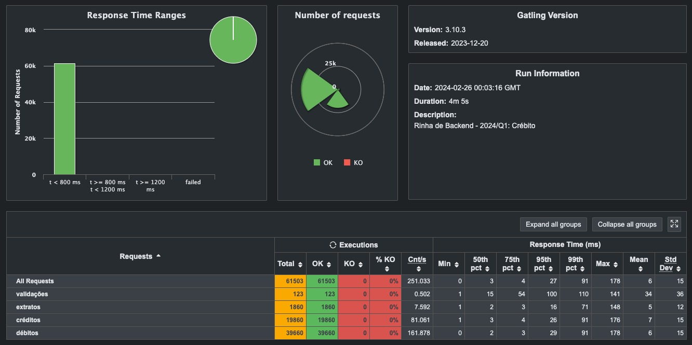

# 🐔 Rinha de Backend - 2024/Q1

A Rinha de Backend é um desafio que tem como principal objetivo compartilhar conhecimento em formato de desafio. Neste repositório você encontrará a solução desenvolvida por [@emiliosheinz](https://github.com/emiliosheinz) e [@fumegalli](https://github.com/fumegalli) utilizando Node.js juntamente com o framework Nest.js e o banco de dados PostgreSQL. Para maiores detalhes sobre o desafio, acesse o [repositório oficial da Rinha de Backend](https://github.com/zanfranceschi/rinha-de-backend-2024-q1).


## Resultados

Abaixo você encontra os resultados dos testes de carga realizados localmente na aplicação. Foi possível fazer com que todas as requisições fossem respondidas corretamente em menos de 500ms. Fazer o Lock apropriados das linhas do banco de dados foi essencial para garantir a integridade dos dados em cenários de alta concorrência.



## Rodando a aplicação localmente

Para rodar o projeto localmente, seguir um dos passo a passos abaixo:

### 1. Utilizando a imagem disponível no ghcr.io

Neste modo o Docker utilizará a ultima imagem da aplicação disponível no repositório do [ghcr.io](https://github.com/emiliosheinz/rinha-de-backend-2024-q1/pkgs/container/rinha-de-backend-2024-q1). Portanto, nenhuma modificação de código feita localmente será aplicada.

```bash
docker-compose up -d
```

### 2. Utilizando o código fonte local

O comando abaixo irá criar um arquivo `docker-compose.override.yaml` que garantirá que o Docker utilize o código fonte local ao invés da imagem disponível no `ghcr.io`. Após isso, o comando `docker-compose up -d` irá subir a aplicação. Esse é o método recomendado caso você tenha realizado alguma modificação no código fonte e queira rodar o teste de carga localmente.

```bash
cat docker-compose.override.example.yaml > docker-compose.override.yaml && docker-compose up -d
```

### 3. Modo de desenvolvimento (com hot-reload)

Para rodar a aplicação em modo de desenvolvimento, é necessário seguir os passos abaixo:

1. Rode o comando para gerar o arquivo de override:

   ```bash
   cat docker-compose.override.example.yml > docker-compose.override.yml
   ```

2. Descomente as linhas abaixo no arquivo `docker-compose.override.yml` gerado no passo anterior:

   ```yaml
   command: 'npm run start:dev'
   volumes:
     - ./src:/app/src
     - ./node_modules:/app/node_modules
   ```

3. Rode o comando abaixo para subir a aplicação:

   ```bash
   docker-compose up -d
   ```

## Rodando os testes E2E

Para garantir que qualquer modificação feita na base de código não quebrou nenhuma funcionalidade, você pode rodar os testes E2E com o comando abaixo:

```bash
npm run test:e2e
```

## Rodando os testes de carga

Para rodar os testes de carga, é necessário que você tenha a ferramenta [Gatling](https://gatling.io/) instalada em sua máquina. Após isso, basta rodar o comando abaixo:

```bash
./executar-teste-local.sh
```
